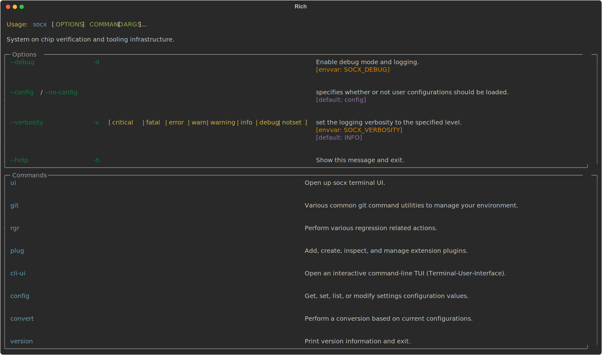
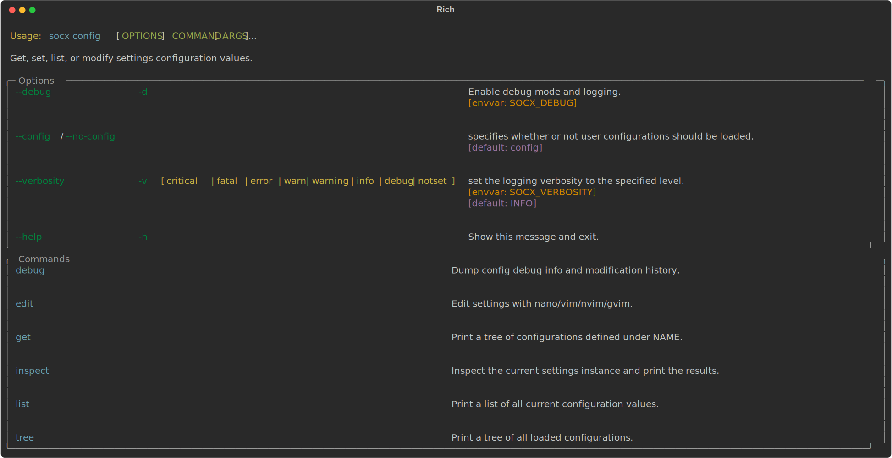

# socx – SoC Verification CLI Tool


## Table of Contents

<!--toc:start-->

- [socx – SoC Verification CLI Tool](#socx-soc-verification-cli-tool)]

  - [Key Features](#key-features)
  - [Getting Started](#getting-started)
  - [Commands and Usage](#commands-and-usage)
    - [1. Configuration Management (`socx config`)](#1-configuration-management-socx-config)
    - [2. LST File Conversion (`socx convert`)](#2-lst-file-conversion-socx-convert)
    - [3. Regression Test Runner (`socx rgr`)](#3-regression-test-runner-socx-rgr)
    - [4. Example Plugin (`socx example`)](#4-example-plugin-socx-example)
  - [Configuration and Environment Details](#configuration-and-environment-details)
  - [Examples and Typical Workflows](#examples-and-typical-workflows)
  - [Troubleshooting and Tips](#troubleshooting-and-tips)
  - [Extending socx with Plugins (Advanced)](#extending-socx-with-plugins-advanced)

  <!--toc:end-->

## General

`socx` is a command-line tool designed for RISC-V SoC verification
teams to streamline common tasks. It provides a unified CLI with modular
commands (via plugins) to manage test regressions, parse and convert
output files, and configure settings.

`socx` helps verification engineers run test suites, generate coverage
artifacts, and inspect or tweak tool configuration – all from one
convenient interface.

## Key Features

- **Regression Automation:**

  Run multiple tests in parallel and gather pass/fail results with a
  single command. Easily re-run failing tests from previous regressions.

- **LST Conversion to SV:**

  Convert symbol table listing files (LST) into SystemVerilog covergroup
  definitions or other formats, automating coverage model generation.

- **Configuration Management:**
  Inspect and modify tool settings on the fly. All configurations
  (paths, parallelism, etc.) are centralized and adjustable via CLI commands.

- **Plugin Architecture:**

  Extend socx with custom commands. Built-in plugins include regression
  (`rgr`), conversion (`convert`), configuration (`config`), and an
  example plugin to demonstrate how new extensions can be added.

## Getting Started

Once socx is installed, you can invoke the CLI by typing `socx` in your
terminal. To see available commands and general options, run:

> ```bash
> socx --help
> ```
>
> 

You can also get help on a specific command, for
example: `socx rgr --help` or `socx config --help` to see usage details
and options.

Before running certain commands, ensure any required environment
variables (like `$WAREA` or `$TOP_VERIF`) are set to match your
project’s directory structure.

## Commands and Usage

Below is an overview of each main command group in `socx`, with typical usage
examples and applications:

### 1. Configuration Management (`socx config`)

The `socx config` command group allows you to view and change `socx`’s
configuration settings. This is useful for customizing file paths, adjusting
parallel run limits, or toggling features to fit your
environment.

> ```bash
> socx config --help
> ```
>
> 

Available subcommands under `socx config` include:

- **`socx config inspect`** – Displays the internal configuration object
  with all fields (for debugging purposes).

- **`socx config list`** – Prints all current configuration values as a
  dictionary. This is a quick way to see what settings are in effect
  (including defaults and any overrides).

- **`socx config tree`** – Shows all current configuration in a pretty
  hierarchical tree format, which is much easier to read for nested settings.

- **`socx config get <name>`** – Retrieves a specific configuration
  value (or group of values) by name. For example:

  ```bash
  socx config get regression.max_runs_in_parallel
  ```

  would output the current setting for the maximum number of
  parallel test runs (default is 10).

- **`socx config set <name> <value>`** – Updates a configuration setting
  at runtime. For example, you can do:

  ```bash
  socx config set regression.max_runs_in_parallel 5
  ```

  to temporarily limit parallel test execution to 5. (The change
  applies to the running session – see note below on persistence.)

- **`socx config edit`** – Launches an interactive editor to modify
  configuration files. You’ll be prompted to choose which config file to
  edit (default or local override) and which editor to use (e.g., vim or
  nano).

  This allows you to permanently change settings (like paths or
  defaults) in the TOML config files. Simply save and exit the editor to
  apply changes, or exit without saving to cancel.

**Use Case:**

_Configuration management is useful when setting up socx for the first
time or adjusting it for a new project environment._

For instance, if your regression logs or LST files reside in non-default
locations, you can update those paths using `socx config set` or by
editing the config. To get an overview of all configurable options,
`socx config list` or `socx config tree` provides a full dump.

**Persistence Note:**

The `get` and `list` commands are read-only. The `set` command changes
the configuration for the current session (in memory). To make changes
permanent, use `socx config edit` to update the configuration file
(which is typically a `settings.local.toml` or similar in the socx
config directory). Alternatively, you can set environment variables or
create a local config file as described in the project docs to override
defaults.

### 2. LST File Conversion (`socx convert`)

The `socx convert` group contains commands to transform various file
types for verification purposes. Currently, the primary conversion
provided is for **LST files** (listings of symbols or addresses) into
SystemVerilog constructs.

Subcommand: **`socx convert lst`**

- **Description:**

  Converts symbol table files (usually with extensions `.lst` or
  `.list`) into SystemVerilog covergroup files. This helps generate
  coverage models or constant definitions automatically from a list of
  symbols/addresses.

- **Operation:**

  By default, the tool will look into a source directory (configured in
  settings as `convert.lst.source`) for any files matching specified
  patterns (e.g., `*.lst` or `*.list`). It will read those files, parse
  their content, and produce output files in the target directory
  (`convert.lst.target`) according to defined name mappings. The
  conversion uses a built-in parser and formatter to ensure the output
  is properly structured SystemVerilog code.

- **Usage:**

  Simply run:

  ```bash
    socx convert lst
  ```

  This will process all include-matching files in the source path
  and write converted outputs to the target path. The conversion runs
  non-interactively and prints logs to indicate which files were
  processed.

  For example, suppose you have a file `hwsList.lst` (containing hardware
  signal indices for coverage) in the source directory. The tool might
  generate an output file named `pixie_hws_cgs.svh` in the target
  directory (according to a mapping rule for that specific
  filename). Likewise, a file `SPUList.list` might be converted to
  `SPUList.sv`, etc. The mapping between input and output names can be
  configured (by default, `.lst` files become `.svh`, and `.list` files
  become `.sv`, with some special cases handled as defined in the config).

**Practical Application:**

_Automating coverage and model generation._

Instead of manually writing covergroup definitions or constant tables
for every signal, you maintain an LST file (often generated by another
script or tool). Running `socx convert lst` quickly turns those lists
into ready-to-use SystemVerilog include files. This ensures consistency
and saves time, especially when symbol tables change frequently.

**Configuration:**

The source and target directories, file inclusion patterns, and naming
conventions are all configurable via `socx config`. For instance, `socx
config get convert.lst.source` will show the current source path. By
default, these may use environment variables like `$WAREA` or
`$TOP_VERIF` to integrate with your verification environment. Ensure
those environment variables are set, or modify the paths in config, so
that socx knows where to find your input LST files and where to put
outputs. You can also specify include/exclude patterns for file names
and how to handle name collisions (overwrite or backup) in the
conversion settings.

### 3. Regression Test Runner (`socx rgr`)

The `socx rgr` command group is one of the core features of socx,
designed to help run suites of tests (a regression) and manage the
results. It wraps around your existing test execution command (for
example, a `socrun` command or similar that actually runs a test in
simulation) and provides orchestration and result collection. This is
especially useful for nightly regressions or continuous integration,
where you want to run many tests and then focus on the failures.

Subcommands under `socx rgr` include:

- **`socx rgr run -i <file>`** – Run a regression based on a list of
  test commands.

- **Input:** You provide an input file (`-i` or `--input`) which
  contains one test invocation per line. Each line should be the full
  command to run a test. For example, your file might contain lines
  like:

  ```text
  socrun --flow sim --build Debug --test path/to/test1.cfg --seed 0
  socrun --flow sim --build Debug --test path/to/test2.cfg --seed 0
  ```

  (Here `socrun` is assumed to be your test execution script or
  binary. It could be any command – socx will execute it as given.)

- **Execution:** socx will launch each test in parallel (by default,
  up to 10 at a time, as configured by
  `regression.max_runs_in_parallel`). It uses asynchronous scheduling
  to maximize throughput while respecting the limit. You will see a
  progress indicator or logs showing tests being scheduled and
  completed.

- **Results:** After all tests finish, socx produces two output files:
  one listing all tests that **passed** and one listing all tests that
  **failed**. By default, these files are placed in a timestamped
  directory under the configured output path for regression
  results. For example, you might find a folder named `28-02-2025/`
  (using the current date) containing `04-05_passed.log` and
  `04-05_failed.log` (if the run started at 04:05). Each of those
  files contains the original command lines from your input
  corresponding to tests that passed or failed, respectively. It also
  logs summary information to the console.
- **Example:**

  ```bash
    socx rgr run -i tests_to_run.txt
  ```

  Suppose `tests_to_run.txt` had 100 test lines. socx will run them (10
  at a time by default) and, upon completion, you might see
  `28-02-2025/07-30_passed.log` with (let’s say) 90 lines and
  `28-02-2025/07-30_failed.log` with 10 lines, if 10 tests failed. You
  can then inspect those failing tests for debugging or feed them into a
  rerun.

- _Tip:_ You can control the parallelism or other behaviors via
  config. For instance, to run tests one at a time (for easier log
  viewing or resource reasons), set `regression.max_runs_in_parallel`
  to 1 using the config commands.

- **`socx rgr rerun_failure_history`** (alias: **`socx rgr rrfh`**) –
  Re-run previously failed tests from past regressions.

- **Description:** This command looks at the recorded history of
  failed tests and triggers a rerun for them. It is essentially an
  automated way to take all failing test cases from your last
  regression(s) and run them again, perhaps after fixes or just to
  verify flakiness.

- **How it works:** By default, socx expects a "failure history" log
  file in a known location (configured as
  `regression.logs.files.failure_history`, typically pointing to
  something like a `failed_tests_history.log`). This file should
  contain a list of test command lines that previously failed
  (aggregated over time or at least from the most recent run). When
  you run `socx rgr rerun_failure_history` without any arguments, socx
  will use that configured file as the input and automatically execute
  those tests, just like the `run` command does. You can also specify
  `-i` and `-o` options to override the default input file or output
  directory if needed (but usually it’s not required for this
  command).
- **Results:** The rerun will generate new passed/failed logs (in the
  same manner as the `run` command). By default, the output directory
  for reruns is configured separately (to avoid overwriting the
  original run’s logs). For example, it may save results under a
  `rerun_failures/<date>/` folder. After running, you can see which
  previously failing tests are now passing and which still fail, by
  checking the newly created logs.

- **Usage:**

  ```bash
  socx rgr run
  ```

  (This assumes your config knows where the failure history log
  is. If you want to point to a specific file of failures, you could
  do `-i custom_fail_list.txt`. Usually, the alias `rrfh` does the
  same thing in a shorter form.)

- **Example Scenario:** You ran a large regression with `socx rgr run`
  and got a set of failing tests recorded. After investigating and
  fixing some issues, you want to quickly re-test all those
  failures. Instead of manually preparing an input file, just run the
  rerun command. socx will pick up the last failure list and rerun
  them. This is very handy for iterative debug and fix cycles.

  Both `run` and `rerun_failure_history` accept an optional **`-o
<directory>`** argument to specify a custom output directory for the
  results. If you don’t specify `-o`, socx uses its default path (which
  includes organizing by date/time as described). You can configure that
  default path via `socx config` if you prefer all results to go to a
  certain folder.

- **Additional Notes for `rgr`:** The regression mechanism in socx will
  capture each test’s output and return code. It considers a test “passed”
  if the process exits with code 0 and **no internal errors** are
  detected, and “failed” if a non-zero code or errors are present. socx
  even parses simulator log files (through a post-processing utility) to
  double-check test outcomes, ensuring that a pass truly means all checks
  passed (not just that the process exited cleanly). The tool will handle
  termination signals and exceptions – if you abort (`Ctrl+C`) in the
  middle of a run, it will try to terminate any running test processes.

### 4. Plugin (`socx plug`)

The `socx plug example` command is a simple demonstration of socx’s plugin
system. It doesn’t perform verification tasks, but it’s included to show
how easy it is to extend the CLI with new commands.

- **Usage:** `socx plug example`

- **What it does:** When you run this, it will clear the console and
  print a friendly greeting message (with some fun ASCII/emoji art via
  rich text). It will then prompt you (Yes/No) asking if you want to see
  the source code of the example plugin itself. If you answer yes, it
  will display the Python code for the plugin on the screen with syntax
  highlighting. If no, it just exits after the greeting.

- **Why it’s there:** If you are a developer or an advanced user
  interested in adding your own plugin, the example serves as a
  template. It shows the basic structure: a function decorated with
  `@click.command` (or `@click.group`) and the use of rich text
  formatting and confirmation prompts. Essentially, you can copy this
  pattern to create new subcommands for socx.

Feel free to run `socx plug example` to ensure your installation is working
and to see socx’s rich output formatting in action.

## Configuration and Environment Details

socx’s behavior is highly configurable to fit into different project
environments. The configuration is managed via Dynaconf and is loaded
from TOML files (with defaults provided in the package and optional
local overrides).

Some important configuration aspects to be aware of:

- **Default Config Files:** The tool comes with default config in
  `settings.toml` (and included files like `plugins.toml`,
  `converter.toml`, `regression.toml`, etc.). These define default
  paths, file patterns, and plugin mappings. You typically do not need
  to edit the defaults; instead, create a local config if overrides are
  needed.

- **Local Configuration:** You can have a `settings.local.toml` (which
  is read by Dynaconf if present) to override defaults. The `socx config
edit` command can help create/edit this file. Values in the local
  config will take priority over the defaults. This is the recommended
  way to customize socx for your environment (for example, setting the
  regression `path` to your own regression results directory, or
  changing `max_runs_in_parallel`).

- **Environment Variables:** The config supports environment variable
  interpolation. In the default config, you’ll notice placeholders like
  `{env[WAREA]}` or `{env[TOP_VERIF]}`. These mean socx will substitute
  the value of the environment variable `WAREA` or `TOP_VERIF` if it’s
  set in your shell. For example, `convert.lst.source` might be defined
  as:

  ```toml
  source = "@path @format {env[WAREA]}/Pixie_ROM_FW/..."
  ```

  This allows the tool to
  dynamically use paths based on your environment. **Before running
  socx, ensure those environment vars are exported** or adjust the
  config to not require them. If an environment variable is not set, the
  path may resolve to an empty string or incorrect location, so it’s
  important to configure these correctly. You can always check what path
  is being used by running `socx config get convert.lst.source` (or the
  relevant key) to see the resolved result.

- **Plugin Configuration:** The `plugins.toml` file in config lists all
  plugin scripts that socx will load. By default it includes `rgr`,
  `config`, `example`, and `convert` (LST). If you ever develop a new
  plugin module, you’d register it in this file (or via `socx config`
  commands) so that the main CLI picks it up. The tool’s design is such
  that it will automatically discover these and make them available as
  `socx <plugin-name>` commands.

- **Logging and Verbosity:** socx uses a rich logging system under the
  hood. While it generally prints user-friendly output, you can increase
  verbosity (for debugging) by a global option if provided (e.g., `-v`
  for debug logs, if supported). Check `socx --help` to see if a
  `--verbosity` or similar option exists globally. This can help
  troubleshoot issues by printing internal debug messages. By
  default, only important info is shown.

## Examples and Typical Workflows

To tie everything together, here are a couple of realistic scenarios
using socx:

- **Running a Nightly Regression:**

  1. Ensure your test list is up-to-date (say you generate
     `nightly_tests.txt` with all tests to run).

  2. Execute `socx rgr run -i nightly_tests.txt`. Go grab a coffee while
     tests execute in parallel. You’ll see progress in the terminal.

  3. After completion, open the `<date>/<time>_failed.log` to see which
     tests failed. Suppose 5 tests failed.

  4. Use those results for debugging. Perhaps also add those 5 lines to
     a cumulative failure history file if you maintain one (the tool can be
     configured to do this automatically or you can copy them).

  5. The next day (or after fixes), run `socx rgr rerun_failure_history`
     to re-run all historically failing tests and confirm if they pass
     now. This uses the recorded failure list so you don’t miss any
     regressions in previously failing cases.

- **Generating Coverage Definitions from Spec:**

  1. After design changes, you get updated \*.lst files (e.g., a list of
     opcodes or events to cover). Place these files in the directory that
     socx is configured to read (or update the config to point to them).

  2. Run `socx convert lst`. The tool will parse each list and create
     corresponding SystemVerilog include files with coverage group
     definitions or constants.

  3. Include these generated `.svh`/`.sv` files in your simulation
     environment. They contain up-to-date definitions reflecting the latest
     design info, without manual editing.

  4. If something isn’t right (e.g., a path was wrong or a file was
     skipped), use `socx config list` or `tree` to review the convert
     settings (you might find an exclude pattern that filtered out your
     file, etc.), adjust accordingly, and run again.

- **Inspecting/Changing Configuration:**

  1. You want to change the default number of parallel runs from 10 to 4
     for a specific debug session (maybe to avoid heavy load). You run:

     ````bash

     socx config set regression.max_runs_in_parallel 4
     socx rgr run -i failing_tests.txt

     ```Now socx will run with at most 4 tests at once.

     ````

  2. Later, you decide to make this change permanent in your config.

     Run `socx config edit`, pick the appropriate config file (likely
     `settings.local.toml`), and add:

     ```toml
     [regression]
     max_runs_in_parallel = 4
     ```

     Save and exit.

     Next time you run a regression, it will default to 4 in parallel.

  3. Unsure of what config keys exist? Run `socx config tree` to see the
     structure.

     You might discover other useful knobs (for example,
     `regression.path` for log storage, or `convert.lst.includes` for
     file patterns).

## Troubleshooting and Tips

- **“Command not found” or No Output:**

  If running `socx` does nothing or the command is not found, make sure
  the installation succeeded and the Python environment is
  activated.

  The `socx` entry point is installed via the package’s setup; if
  needed, you can also run it as a module with `python -m socx ...`.

- **Environment Variables Not Recognized:**

  If a convert or regression command is not finding files or writing
  where expected, check if environment variables like `WAREA` or
  `TOP_VERIF` are set in your shell. If not, either set them or update
  the socx config to use explicit paths. You can always override the
  configured paths by editing the config or by providing command options
  (for example, if a future version of `socx convert lst` supports
  `-s/--source` and `-t/--target` options, those could override the
  defaults at runtime).

- **Test Execution Fails Immediately:**

  The `rgr run` command relies on an external test runner (e.g.,
  `socrun`). If socx cannot spawn the test process (for instance, if
  `socrun` is not in your PATH or is misnamed), the tests will
  fail. Ensure your input file lines are correct and that you can run
  those commands manually. socx will capture the stdout/stderr of each
  test; you can check the failure log or console output for any error
  messages from the test process.

- **Partial Runs or Interruption:**

  If you interrupt a regression run (Ctrl+C), socx will try to kill
  running tests. However, in some cases you might end up with some
  processes still running (depending on how graceful the system
  was). Use `ps` or your system’s process monitor to ensure all test
  instances stopped if you had to force-quit. On the next run, you may
  want to use the rerun feature to resume where you left off (adding any
  not-run tests to the input file).

- **Viewing Detailed Logs:**

  socx uses the **Rich** library to format output. If you prefer plain
  text logs or need to redirect output to a file, you can do so (the
  colors may come through as ANSI codes in a raw file; in that case,
  consider piping through `sed` or using the `--no-color` option if
  available). For internal debugging, increasing verbosity via config or
  environment (e.g., setting an env var like `SOCX_LOG_LEVEL=DEBUG` if
  supported) will show more info. The tool’s debug logs can reveal how
  plugins are loaded or why a particular file was skipped.

## Extending socx with Plugins (Advanced)

socx is built with a plugin architecture, meaning you can add new
commands without modifying the core code. Each plugin is essentially a
Python module that defines a Click command or group (with subcommands),
and is registered in the configuration so that socx loads it at runtime.

If your verification workflow has additional needs – for example,
parsing a custom log, generating reports, or interfacing with other
tools – you can create your own plugin. Here’s a high-level guide:

- **Create a Plugin Module:**

  Write a Python file (e.g., `myplugin.py`) following the pattern of
  existing ones. Use `@click.command` or `@click.group` to define CLI
  entry points, and implement the logic you need. You can use `rich` for
  pretty output, and you have access to all socx utilities and config by
  importing from the `socx` package (for example, `from socx import
console, settings` to use the global console and config).

- **Return a Command named `cli`:**

  In your plugin module, ensure you define a function (or group) named
  `cli` – this is what socx looks for when loading the plugin. For a
  single command plugin, do something like:

  ```python
  import rich_click as click

  @click.command("myplugin")
  @click.option("--foo", help="Example option")
  def cli(foo):
      """One-line description of my plugin."""
      # ... your code ...
      click.echo("My plugin is running with foo=%s" % foo)
  ```

  This will create a new command `socx myplugin`. If you need
  subcommands, use `@click.group("myplugin")` and then define functions
  with `@cli.command()` as seen in the regression or config plugins.

- **Register the Plugin:**

  Open the `plugins.toml` configuration (via `socx config edit` or
  editing the file under `socx/static/toml/plugins.toml` in the
  source). Add an entry for your
  plugin, for example:

  ```toml
  [plugins]
  myplugin = "@path @format /full/path/to/myplugin.py"
  ```

  (You can also use a relative path if it’s within the project
  directory.) Save the config. The `@path @format` syntax is used in
  config to indicate a file path – just follow the pattern of existing
  entries.

- **Run `socx`:**

  The next time you run `socx`, it will load your plugin and make the
  `myplugin` command available. You can verify by running `socx --help`
  and seeing your new command listed.

  By structuring the tool this way, the verification team can grow the CLI
  as the project evolves – adding new capabilities without touching the
  core. The example plugin (`socx example`) can be consulted as a
  reference for how to do things like clearing the screen, prompting the
  user, or even printing its own source code.
