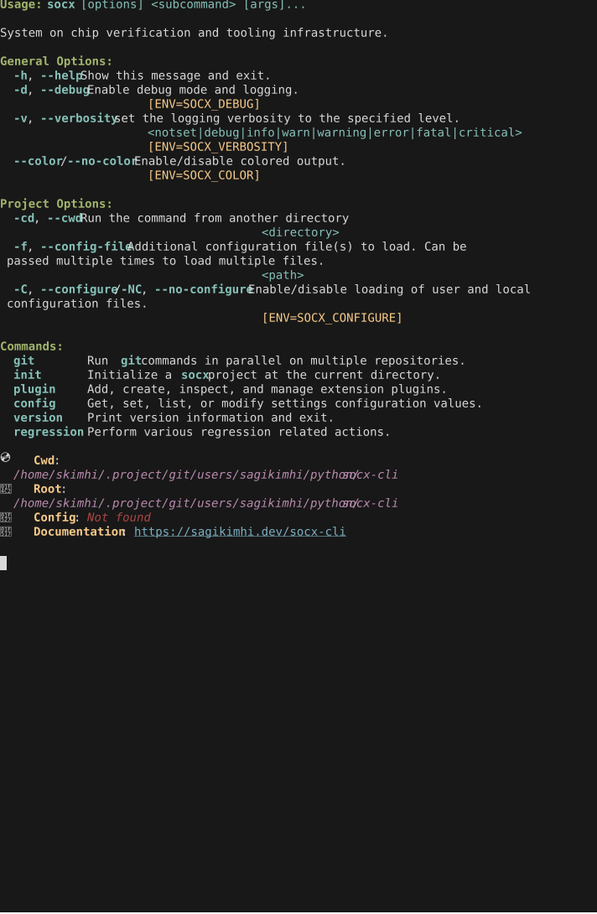

# SoCX CLI

[](https://github.com/astral-sh/uv)
[](https://github.com/astral-sh/ruff)
[](https://github.com/pypa/hatch)
[](https://github.com/pre-commit/pre-commit)
[](https://pypi.org/p/socx-cli/)
[](https://pypi.org/p/socx-cli/)
[](https://pypi.org/p/socx-cli/)



SoCX is a command-line toolbox for EDA development teams.

SoCX can also be used in your own python project/library/script and provides an
extensive API with many useful features targeted at EDA development.

For details, please refer to the [official documentation page](https://sagikimhi.dev/socx-cli/).

## Installation

> [!IMPORTANT]
> ensure you meet the following perquisites before proceeding with the
> installation of `socx`:
> -  A working installation of `pip` or [`uv`](https://github.com/astral-sh/uv).
> -  A working installation of Python 3.12 or newer version.

### Install as a tool

**with `uv`**:

```bash
uv tool install socx-cli
```

**with `pip`**:

```bash
pipx install socx-cli
```

### Run directly (without an installation)

**with `uv`**:

```bash
uvx --from socx-cli socx
```

**with `pip`**:

```bash
pipx run --spec socx-cli socx
```

### Add to your python project

**with `uv`**:

```bash
uv add socx-cli
```

**with `pip`**:

```bash
pip install socx-cli
pip freeze -r requirements.txt
```

### Upgrading to the Latest Version

**with `uv`**:

```bash
uv tool update socx-cli
```

**with `pip`**:

```bash
pipx upgrade socx-cli
```

> [!TIP]
> You can run the below command to verify `socx` was properly installed.
>
> ```console
> $ socx version
> Name: socx-cli
> Version: 0.11.5
> Summary: System on chip verification and tooling infrastructure.
> Home-page: https://sagikimhi.dev/socx-cli
> Author:
> Author-email: Sagi Kimhi <sagi.kim5@gmail.com>
> License-Expression: Apache-2.0
> Location: /home/skimhi/.project/git/users/sagikimhi/python/socx-worktree/develop/.venv/lib/python3.14/site-packages
> Editable project location: /home/skimhi/.project/git/users/sagikimhi/python/socx-worktree/develop
> Requires: click, copier, dynaconf, gitpython, hoptex, jinja2, paramiko, pip,
> platformdirs, plumbum, prompt-toolkit, psutil, pydantic, pygit2, python-box,
> rich, rich-click, sh, textual, textual-speedups, typer, uv, werkzeug
> Required-by:
> ```

## Documentation & Community

- Project Documentation: <https://sagikimhi.dev/socx-cli>
- Community Discussions: <https://gitter.im/socx-cli/community>

## License

Licensed under Apache-2.0.

See [LICENSE](home/license.md) for details.
