# :lucide-package-open: Getting Started

<div class="grid cards" markdown>

-   ## SoCX CLI

    [](https://github.com/astral-sh/uv)
    [](https://github.com/astral-sh/ruff)
    [](https://github.com/pypa/hatch)
    [](https://github.com/pre-commit/pre-commit)
    
    
    

    ---

    `socx` is a command-line toolbox for originally created to streamline EDA
    development across separate yet tightly coupled projects and teams.

    SoCX can also be used as a library in your own python package/script and
    provides an extensive API with many useful features targeted at, but not
    limited to, common EDA development requirements and solutions for single
    projects that are coupled and depend on multiple separate smaller projects
    maintained by multiple independent teams.

</div>
<div class="grid cards" markdown>

-   ## :lucide-download: Installation

    !!! warning "Requirements"

        Before performing the installation, make sure that you meet all the
        perquisites listed below:

        - [x] A working installation of `pip` or [`uv`](https://github.com/astral-sh/uv){title="Recommended"}.
        - [x] A working installation of Python 3.12 or newer version.


    === "Install as a tool"

        === "`uv`"

            ```bash
            uv tool install socx-cli
            ```

        === "`pip`"

            ```bash
            pipx install socx-cli
            ```

    === "Run directly (without an installation)"

        === "`uv`"

            ```bash
            uvx --from socx-cli socx
            ```

        === "`pip`"

            ```bash
            pipx run --spec socx-cli socx
            ```

    === "Add to your python project"

        === "`uv`"

            ```bash
            uv add socx-cli
            ```

        === "`pip`"

            ```bash
            pip install socx-cli
            pip freeze -r requirements.txt
            ```

    ??? tip "Verifying Your Installation"

        Run the below commands to verify `socx` was properly installed.

        If your outputs match the below outputs, the CLI was properly
        installed.

        ```console exec="1" source="console" result="console" title="socx version"
        $ socx version
        ```

    ??? tip "Upgrading to the Latest Version"

        === "`uv`"

            ```console
            $ uv tool update socx-cli
            ```

        === "`pip`"

            ```console
            $ pipx upgrade socx-cli
            ```


</div>
<div class="grid cards" markdown>

-   ## Command Showcase

    === "**__:lucide-github: Git Commands__**"

        - [x] Manage multiple repositories/projects from a single unified command line interface.
        - [x] Execute git commands across multiple repositories in parallel.
        - [x] Strong focus on dynamic configurability and flexibility.
        - [x] Designed to meet a large variety of custom needs from separate teams that together make up a superproject.

        === "`socx git`"

            { width="800" loading=lazy }
            /// caption
            ///

        === "`socx git log`"

            { width="800" loading=lazy }
            /// caption
            ///

        === "`socx git help`"

            { width="800" loading=lazy }
            /// caption
            ///

        === "`socx git status`"

            { width="800" loading=lazy }
            /// caption
            ///

        === "`socx git summary`"

            { width="800" loading=lazy }
            /// caption
            ///


    === "**__:lucide-cog: Configuration Commands__**"

        === "`socx config`"

            { width="800" loading=lazy }
            /// caption
            ///

        === "`socx config get`"

            { width="800" loading=lazy }
            /// caption
            ///

        === "`socx config dump`"

            { width="800" loading=lazy }
            /// caption
            ///

        === "`socx config list`"

            { width="800" loading=lazy }
            /// caption
            ///

        === "`socx config tree`"

            { width="800" loading=lazy }
            /// caption
            ///

        === "`socx config debug`"

            { width="800" loading=lazy }
            /// caption
            ///

        === "`socx config inspect`"

            { width="800" loading=lazy }
            /// caption
            ///


    === "**__:lucide-plug: Plugin Commands__**"

        === "`socx plugin`"

            { width="800" loading=lazy }
            /// caption
            ///

        === "`socx plugin example`"

            { width="800" loading=lazy }
            /// caption
            ///

        === "`socx plugin schema`"

            { width="800" loading=lazy }
            /// caption
            ///

    === "**__:lucide-flask-conical: Regression Commands__**"

        === "`socx rgr`"

            { width="800" loading=lazy }
            /// caption
            ///

        === "`socx rgr run`"

            { width="800" loading=lazy }
            /// caption
            ///

</div>
<div class="grid cards" markdown>

-   ## Next Steps

    <div class="grid cards" markdown>

    -   ***:lucide-plug:{ .lg .middle } Plugins Guide***

        ---

        Proceed to the [plugins](user-guide/quickstart.md) guide to learn about
        the most fundamental concept in `socx` and how you can use it to create
        and your own custom tooling stack that you can easily share with your
        team in just a few minutes.

        [:lucide-plug: Plugins Guide](user-guide/plugins.md){ .md-button .md-button--primary }
        /// caption
        ///

    -   ***:lucide-cog:{ .lg .middle } Configurations Guide***

        ---
        The [configuration guide](user-guide/configuration.md) will cover all
        you need to know of in order to truly make use of the dynamic `socx`
        configuration system to achieve great feats tailored to your project
        specific needs.

        [:lucide-file-code: Configuration Guide](user-guide/configuration.md){ .md-button .md-button--primary }
        /// caption
        ///


    -   ***:lucide-file-code:{ .lg .middle } Explore the API***

        ---

        `socx` provides an extensive amount of reusable classes and
        utilities for extending it with your own custom tool stack and
        python scripts. Check out the [API Reference](reference/api.md) to
        learn more.

        [:lucide-file-code: API Reference](reference/api.md){ .md-button .md-button--primary }
        /// caption
        ///

    -   ***:lucide-handshake:{ .lg .middle } Contributing***

        ---

        Contributions are more than welcome and will be highly appreciated!

        Visit the [Contributing](development/contributing.md) page if you’d
        like to help improve the project.

        [ :lucide-handshake: Contributing](development/contributing.md){ .md-button .md-button--primary }
        /// caption
        ///

    </div>
