# Quickstart

<div class="grid cards" markdown>

-   ## :lucide-download: Installing the CLI

    ---

    Before performing the installation, make sure that you meet all the
    perquisites from the requirements list.

    Once all requirements are met, you may follow the below steps to install and
    start using `socx-cli` in your own projects.

    ---

    ???+ warning "Requirements"

        In order to install and use `socx-cli`, the following requirements must be
        met:

        - [x] A working installation of `pip` or [`uv`](https://github.com/astral-sh/uv){title="Recommended"}.
        - [x] A working installation of Python 3.12 or newer version.

    === "Install as a tool"

        ```bash
        uv tool install socx-cli
        ```

    === "Use in your python project"

        ```bash
        uv add socx-cli
        ```

    === "Use in your python script"

        ```bash
        uv add --script socx-cli
        ```

    ??? info "Verifying Your Installation"

        Run the below commands to verify `socx` was properly installed.

        ```bash
        socx --help
        socx version
        ```

        If you see the top-level help and the current version, the CLI is
        ready to use.

    ??? info "Upgrading to the Latest Version"

        ```bash
        uv tool update socx-cli
        ```

</div>

<div class="grid cards" markdown>

-   ## :lucide-square-terminal: Using the CLI

    ---


    __:lucide-github: Git Commands__
    { .card }

    ---

    === "`socx git`"

        { width="800" loading=lazy }
        /// caption
        ///

    === "`socx git log`"

        { width="800" loading=lazy }
        /// caption
        ///

    === "`socx git help`"

        { width="800" loading=lazy }
        /// caption
        ///

    === "`socx git diff`"

        { width="800" loading=lazy }
        /// caption
        ///

    === "`socx git status`"

        { width="800" loading=lazy }
        /// caption
        ///

    === "`socx git summary`"

        { width="800" loading=lazy }
        /// caption
        ///


    __:lucide-cog: Configuration Management__
    { .card }

    ---

    === "`socx config`"

        { width="800" loading=lazy }
        /// caption
        ///

    === "`socx config dump`"

        { width="800" loading=lazy }
        /// caption
        ///

    === "`socx config get`"

        { width="800" loading=lazy }
        /// caption
        ///

    === "`socx config list`"

        { width="800" loading=lazy }
        /// caption
        ///

    === "`socx config tree`"

        { width="800" loading=lazy }
        /// caption
        ///

    === "`socx config inspect`"

        { width="800" loading=lazy }
        /// caption
        ///

    === "`socx config debug`"

        { width="800" loading=lazy }
        /// caption
        ///


    __:lucide-flask-conical: Regression Runner__
    { .card }

    ---

    === "`socx rgr`"

        { width="800" loading=lazy }
        /// caption
        ///

    === "`socx rgr run`"

        { width="800" loading=lazy }
        /// caption
        ///


    __:lucide-blocks: Plugin System__
    { .card }

    ---

    === "`socx plugin`"

        { width="800" loading=lazy }
        /// caption
        ///

    === "`socx plugin example`"

        { width="800" loading=lazy }
        /// caption
        ///

</div>

<div class="grid cards" markdown>

-   ## Next Steps

    ---

    - Continue with the [CLI tour](user-guide/cli.md) for a catalogue of built-in
    commands.

    - Configure regression paths and environment overrides in the
    [Configuration guide](user-guide/configuration.md).

    - Learn how to [automate regression reruns](user-guide/regression.md) or
    [publish your own plugins](user-guide/plugins.md).

</div>
